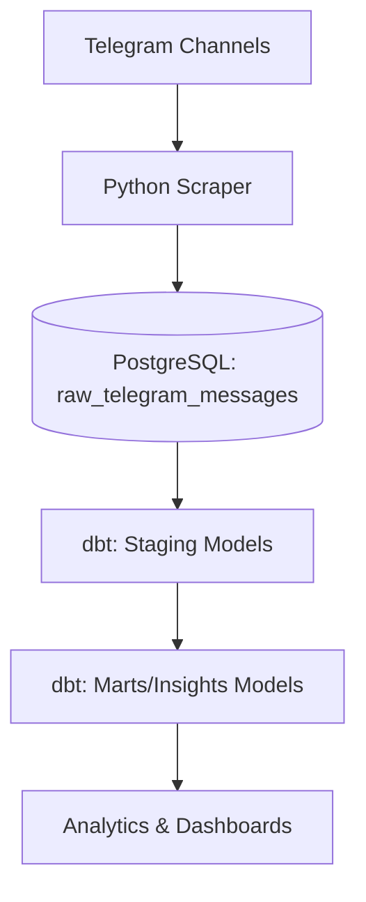

# Telegram Health Insights Pipeline

A data engineering project to extract, process, and analyze health-related insights from Telegram messages using dbt, PostgreSQL, and Python.

---

## Table of Contents

- [Project Overview](#project-overview)
- [Features](#features)
- [Architecture](#architecture)
- [Getting Started](#getting-started)
- [DBT Structure](#dbt-structure)
- [Running the Pipeline](#running-the-pipeline)
- [Contributing](#contributing)
- [License](#license)

---

## Project Overview

**Telegram Health Insights Pipeline** is designed to automate the extraction and transformation of Telegram group/channel messages into structured data, enabling health data analytics and insights.

---

## Features

- **Automated Extraction:** Scrapes messages from Telegram using Python scripts.
- **Data Transformation:** Uses [dbt](https://www.getdbt.com/) for modular, testable SQL-based transformations.
- **PostgreSQL Storage:** Stores raw and processed data in a PostgreSQL database.
- **Health Insights:** Generate metrics and dashboards on health-related discussions in Telegram communities.

---

## Architecture



---

## Getting Started

### Prerequisites

- Python 3.8+
- [dbt](https://docs.getdbt.com/docs/introduction) (v1.10+ recommended)
- PostgreSQL (13+ recommended)
- Telegram API credentials (for scraping)

### Installation

1. **Clone the repository**

   ```bash
   git clone https://github.com/EyasuGet/Telegram-health-insights-pipeline.git
   cd Telegram-health-insights-pipeline
   ```

2. **Set up Python environment**

   ```bash
   python3 -m venv .venv
   source .venv/bin/activate
   pip install -r requirements.txt
   ```

3. **Configure DBT and Database**

   - Copy and update `profiles.yml` for your DBT connection.
   - Ensure your PostgreSQL instance is running and accessible.

4. **Install DBT dependencies**

   ```bash
   dbt deps
   ```

---

## DBT Structure

- `models/`
  - `staging/`: Raw data cleaning and normalization.
  - `marts/`: Business logic, facts, and dimensions.
- `dbt_project.yml`: DBT project configuration.
- `packages.yml`: DBT package dependencies (e.g., dbt_utils).

---

## Running the Pipeline

1. **Scrape Telegram messages**

   Run the Python script (replace with your actual script name):

   ```bash
   python src/scrape_telegram.py
   ```

2. **Run dbt transformations**

   ```bash
   dbt run
   ```

3. **(Optional) Run tests**

   ```bash
   dbt test
   ```

---

## Contributing

Contributions are welcome! Please open issues or submit pull requests for improvements.

---